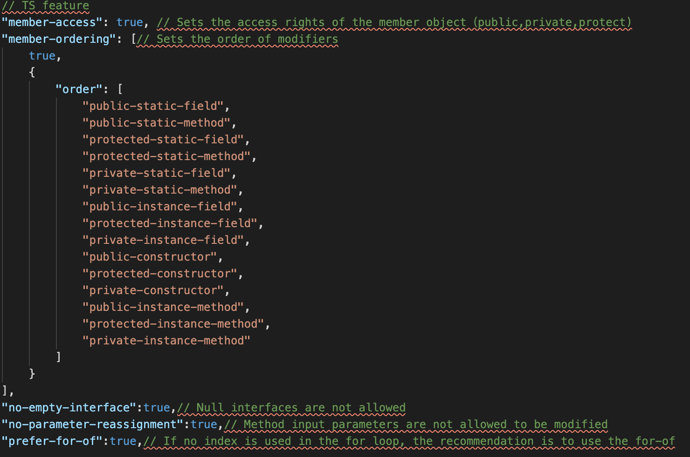
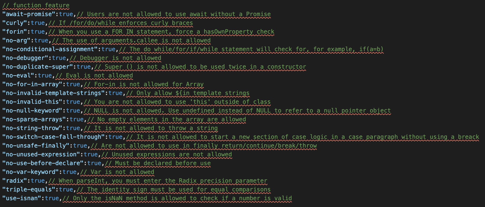
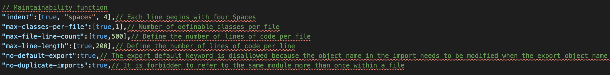
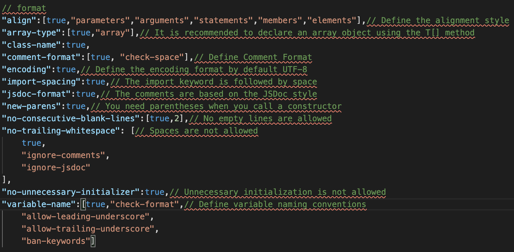

## Sprints & Project Management:

### Evaluation techniques

Our group use three evaluation techniques: question asking, self-rating and observer rating.

|  Evaluation technique   | Items  |
|  ----  | ----  |
| observer rating   | * create the prototype  * feasiblity of project|
| question asking  | * display of web page  * user experience  * reasonable logic following user habit |
| self-rating  | * evaluation of every sprint  * robust of web  * the quality of code  * details of the whole website |

### Timeline

#### Week 6 - Week 7 (11/03/21-19/03/21)

* How to use API

On account of the performance of the news website, we need get loads of results of news by searching, so setting up API for our project is a challenge during development. After setting the CauseVisualiser as our goal, we try to find a way to simplify the phase of creating API. We asked some assistants if we can use the Google API as our API, which includes many fuctions, like searching, storing the data and so on. For our project, the page of search and rating can use this API to fufil.

#### Week 8 - Week 9 (22/03/21 - 30/03/21)

* How to create chessboard

The chessboard is another challenge for our project, because the user will get the conclusion of news by this. During this phase, we should focus on how to create chessboard by logic thinking. Finally, we did this by taking the average of ratings and then represent it on the chessboard accordingly.

#### Week 10 - Week 11 (19/04/21-30/04/21)

* The display of the news web

After finishing the framework of our project, we start to think about how to display our web page. At first, we put the search page and the rating page together where the user can get the links of news after inputing what they want to know. However, some members gave a few suggestion about displaying  the page. Because the web is related with news, we should have a clear page to guide the user input the content which they want to know. So we used the search page as the welcome page, which will give the user explicit instruction.

#### Week 12 (05/05/21-09/05/21)

* Evaluation of the links and rating page

When we almost finished the web, we found some problem with it. One of them is how to avoid the user input ratings repeatly, so the back end must assured that the previous data was stored and the repeat input was rejected when the number of the inputting was incorrect. Another one is the number of the links, and we should find an appropriate number for user. Through the investigation of some friends, they considered that we should not list more than 10 news links, because too many links would lead to fatigue.

### Unit testing

We did the following tests:

